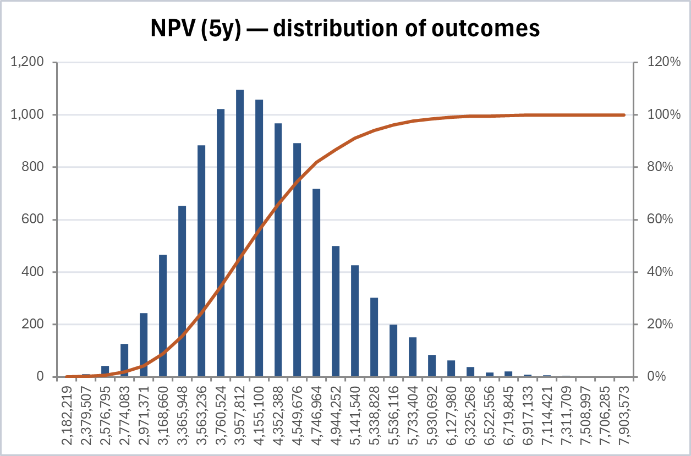
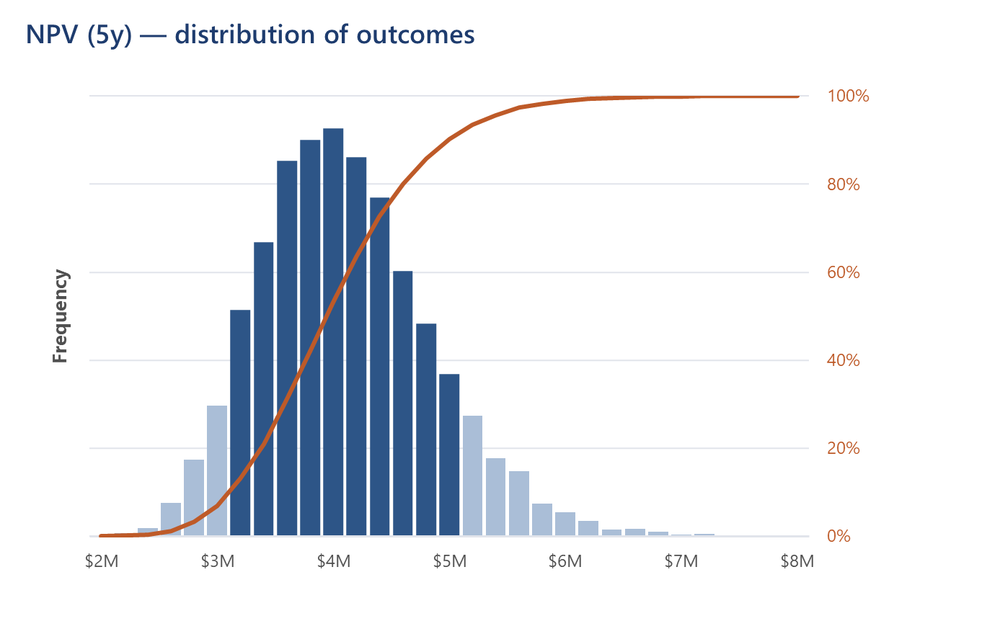

# Chart Style Guide

The rules that make ModelRisk MCP's report charts look professional while staying **native, editable Excel charts** — not embedded images. Every rule is implemented in `src/modelrisk_mcp/bridge/reports.py` and applied automatically by `build_executive_report` and `build_drivers_report`.

The goal: a user can open the report, click into any chart, and tweak it like any Excel chart — but out of the box it already looks like something from a professional risk deck.

---

## Why native charts (not rendered images)

We deliberately render charts as native Excel `Chart` objects rather than matplotlib/PNG embeds. Native charts:

- stay **editable** — the user can recolor, re-scale, add a series, change the type
- carry their **underlying data** (on the hidden helper sheet), so the numbers are inspectable
- print and export cleanly at any zoom
- need no extra runtime dependency

The cost is that Excel's default chart styling is generic. This guide is the ruleset that closes that gap.

---

## The ruleset

### 1. Round-number bins → useful X axis

A histogram's X axis must show meaningful round values (`2M, 3M, 4M…`), never raw min/max-derived bin centres (`2,182,219, 2,379,507…`).

`_nice_bins()` picks a bin width of `1 / 2 / 2.5 / 5 × 10ⁿ` close to `span / 30`, then floors the low edge and ceils the high edge to that width. Bin edges — and therefore the thinned tick labels — land on round numbers.

### 2. Magnitude-aware number formats

Tick labels stay short regardless of scale, via `_axis_scale_format()`:

| Data magnitude | Format | Example |
|---|---|---|
| ≥ 1,000,000 | `#,##0,,"M"` | `4M` |
| ≥ 1,000 | `#,##0,"K"` | `850K` |
| else | `#,##0` | `420` |

No hard-coded `$` — not every model is currency. Percentages use `0%`.

### 3. Thin the category labels

30 bins must not produce 30 labels. `TickLabelSpacing = label_every` (computed by `_nice_bins` so labels fall one nice major-unit apart) gives ~6–8 readable labels.

### 4. Tight gap width

`ChartGroups(1).GapWidth = 16` turns a sparse bar chart into a proper histogram — bars nearly touch, the shape reads as a distribution.

### 5. Central-80% bar shading

Bars whose centre is inside `[P10, P90]` get the **solid brand colour** (`_COLOR_CHART_PRIMARY`, steel blue); the tails get the **muted tone** (`_COLOR_CHART_MUTED`, light blue). This shows the 80% confidence interval directly on the bars — no extra series, no reference lines, fully native. Done per-point via `Points(i).Format.Fill`.

### 6. Drop decoration that doesn't inform

- **Count-axis labels are removed** (`TickLabelPosition = xlNone`). Absolute frequency ("1,043 iterations landed in this bin") is not decision-relevant. The "Frequency" axis title stays so the bars are still explained.
- **No chart-area border, no plot-area border/fill, no legend** when series roles are self-evident from colour + title.
- **No tick marks** (`MajorTickMark = xlNone`) — the labels carry the axis.

### 7. Gridlines belong to the meaningful axis

With the count labels gone, horizontal gridlines move to the **cumulative-probability axis** (the right, %-scaled one): `HasMajorGridlines = True` on the secondary value axis, off on the primary. Gridlines now read as "20%, 40%, 60%…", which is what a reader wants off a risk histogram.

### 8. Secondary axis is hard-capped at 100%

`MinimumScale = 0`, `MaximumScale = 1.0`, `MajorUnit = 0.2`. A cumulative probability axis must never wander above 100%.

### 9. Colour palette

Defined once at the top of `reports.py`; used across every chart so the report has one visual identity.

| Token | Colour | Use |
|---|---|---|
| `_COLOR_CHART_PRIMARY` | steel blue `45,85,135` | histogram core bars |
| `_COLOR_CHART_MUTED` | light blue `170,190,215` | histogram tail bars |
| `_COLOR_CHART_LINE` | burnt orange `190,90,40` | cumulative line + its axis |
| `_COLOR_BAR_POSITIVE` | forest green `40,110,60` | tornado bar (lifts output) |
| `_COLOR_BAR_NEGATIVE` | brick red `170,50,50` | tornado bar (lowers output) |
| `_COLOR_TITLE_BG` | deep navy `30,60,110` | chart titles |
| `_COLOR_GRIDLINE` | soft gray `225,228,235` | gridlines |
| `_COLOR_AXIS_TEXT` | gray `80,80,80` | axis tick labels |

### 10. Typography & title

One font family chart-wide (`Segoe UI`). Title left-aligned, semibold, brand navy, size 13–14. Axis titles size 10, tick labels size 9. Set in `_style_chart_frame`.

### 11. Tornado specifics

- Bars coloured by sign of correlation (green = positive, red = negative) via `Points(i).Format.Fill`.
- `ReversePlotOrder = True` so the strongest driver sits at the top (tornado convention).
- Value axis formatted `0.00` (correlation runs −1…1).

---

## Where each rule lives

| Concern | Function |
|---|---|
| Round bins, label spacing | `_nice_bins`, `_HistogramBins` |
| Magnitude formats | `_axis_scale_format` |
| Percentiles for shading | `_percentile` |
| Histogram assembly + all histogram rules | `_add_histogram_chart` |
| Shared frame (font, borders, title) | `_style_chart_frame` |
| Shared axis styling (tick marks, gridlines, fonts) | `_style_chart_axes` |
| Tornado assembly + tornado rules | `_add_tornado_chart` |

---

## Resilience

Every COM styling call is independently wrapped in `try/except`. A chart type that lacks a given axis, or an Excel version that rejects one property, degrades that single tweak rather than tanking the whole report. The chart still renders; it just skips the unsupported nicety.

---

## Before / after

The visual delta this ruleset produces, both native Excel charts exported via `Chart.Export`:

| Before (pre-0.3.1) | After (0.3.1 ruleset) |
|---|---|
|  |  |
