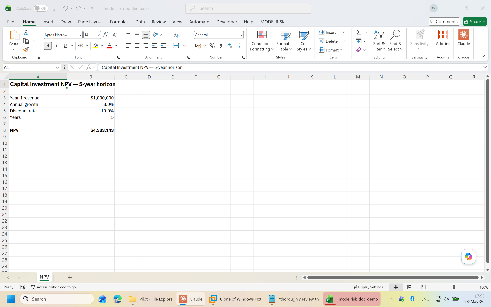
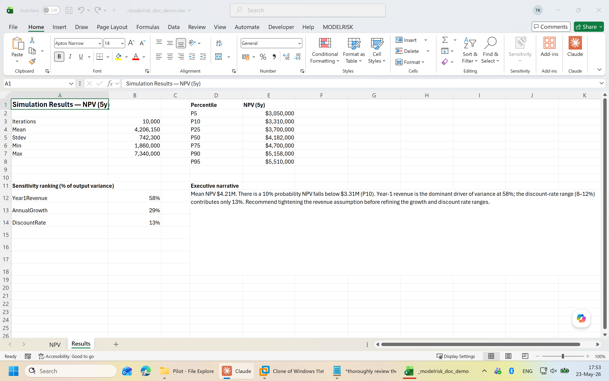

# ModelRisk MCP — User Manual

A practical guide to what ModelRisk MCP can do for you and why it's useful. Not a reference (see [README](../README.md) for the tool list); this is the "what can I actually accomplish with it" document.

> **New here?** The [15-minute quick-start tutorial](quick-start.md) walks you through building your first probabilistic model end-to-end. Then follow a [walk-through scenario](scenarios.md) for your problem type. Domain term unfamiliar? Check the [glossary](glossary.md).

---

## What this is

ModelRisk MCP turns Claude into a methodology-aware co-pilot for your Excel risk models. You keep working in Excel; Claude reads your workbook, writes ModelRisk formulas into it, runs simulations, and reads the results back — all through the official Vose Software toolchain.

Concretely: you describe a risk problem in English, Claude turns it into a quantitative Monte Carlo model, runs 10,000 iterations, and gives you back percentiles, sensitivity rankings, and an executive narrative. Your workbook becomes the model — versionable in Git, auditable, and reproducible — instead of a spreadsheet plus a slide deck of someone's gut feel.

---

## Who this is for

- **Risk analysts and modelers** — anyone whose day involves Excel + uncertainty: NPV under demand uncertainty, project cost overruns, fraud loss aggregates, supply-chain disruption, insurance pricing, reserve adequacy, capacity planning.
- **Finance / FP&A teams** translating "what if oil hits $120 and demand drops 15%" into actual ranges-of-outcomes rather than a single point estimate.
- **Excel-native subject experts** who know their domain cold but don't want to keep all of ModelRisk's 1,400+ functions in their head.
- **Consultancies and audit teams** who need defensible, reproducible Monte Carlo work product that doesn't require a stats PhD to review.

You don't need to be a ModelRisk power user. The server pushes the methodology — Claude proposes the right distribution family, the right fit settings (uncertainty=TRUE), the right wrapper (VoseInput vs bare distribution), and audits your work after.

---

## The eight things you can do

### 1. Build a new probabilistic model from a description

Open a blank workbook. In Claude:

> /build-risk-model
>
> I'm estimating the 5-year NPV of a coffee-roaster capital investment. The big uncertainties are demand growth, the wholesale bean price, and whether a Tier-1 customer renews. Walk me through it.

The `/build-risk-model` prompt drives a 9-step workflow: identify the outputs (NPV at year 5), pick distributions for each uncertain input (lognormal for demand growth, mean-reverting time-series for bean price, Bernoulli for customer renewal), wire the cash-flow model, wrap outputs with VoseOutput, and run 10k iterations.

You stay in the conversation; the workbook fills in around you. Every formula goes through `dry_run=True` by default so you preview before committing.

### 2. Convert an existing deterministic Excel model to probabilistic

Most real Excel models start out as point estimates. "Year-3 revenue = $4.2M" lives in a single cell. The model says nothing about how confident you are or how wide the range is.

> Look at the active workbook. Identify the inputs that are obviously uncertain (round numbers referenced by formulas) and propose appropriate distributions for each.

Claude calls `find_hard_coded_inputs` to find the candidates, `propose_distributions_for_inputs` to suggest distribution families based on the context (a "Discount Rate" cell gets a different proposal than "Quantity Sold"), then `replace_constant_with_distribution` one cell at a time. After each replacement you can decline, accept, or refine.

This is the typical entry point for a team that has ten years of Excel models sitting on SharePoint. You don't rewrite them; you wrap their constants.

### 3. Fit distributions to historical data

You have actual data — five years of weekly sales, two years of incident counts, a sample of project overruns. Instead of guessing parameters:

> Here's historical demand data in column D of the Data sheet. Fit a distribution and replace cell B5 (demand input) with the fit.

Claude calls `fit_distribution_to_data`, which uses ModelRisk's own fitting routines under the hood. It returns the best-fit distribution with `uncertainty=TRUE` enabled — meaning the simulation samples through the *parameter uncertainty* on top of the natural variability, not just the best-fit point estimate. That's the difference between "we're 90% confident demand will be 800–1200" and "best-fit says it's exactly 1000 give or take" — the second number is wrong.

### 4. Build correlated, multi-period, or aggregate structures

Real risk models rarely have independent inputs. Demand and price correlate. Default rates cluster. Project schedule and budget bleed into each other.

- **Correlated inputs**: `create_copula` builds Gaussian, t, Clayton, Frank, Gumbel copulas linking multiple inputs into a single dependency structure.
- **Time series**: `create_time_series` builds AR(1), GBM, mean-reverting, jump-diffusion, and Vasicek processes — for things that have memory across periods (commodity prices, customer churn, interest rates).
- **Aggregates (frequency × severity)**: `create_aggregate_mc` builds compound distributions for "N losses each of size X" — the foundational structure for operational risk, insurance losses, fraud, equipment failures.
- **Risk events**: `create_risk_event` builds binary "fires-or-doesn't" wrappers around an impact distribution — `VoseRiskEvent(p, impact)`. Not `p × impact`; the bimodal structure matters.

You ask in plain English ("link demand growth and bean price with a 0.4 Clayton copula"); the server writes the right multi-cell pattern.

### 5. Audit a model for common mistakes

Either someone else's model arrived in your inbox, or your own model has grown messy enough that you can't trust it. Claude calls `audit_model`, which runs 13 rules across the workbook:

- **VOSE-001** — unknown Vose function names (typos: `VoseNomral`)
- **VOSE-002 / VOSE-005 / VOSE-010** — distributions without wrappers, arithmetic before wrappers, wrappers without distributions
- **VOSE-003** — `Fit(…)` calls without `uncertainty=TRUE` (the silent killer of well-meaning models)
- **VOSE-004** — `VoseOutput` cells that don't actually reference any random input (deterministic output marked as random)
- **VOSE-006** — hard-coded constants that look like inputs (candidates for replacement)
- **VOSE-007** — `VoseRiskEvent` with p=0 or p=1 (degenerate)
- **VOSE-008 / VOSE-009** — unnamed or duplicate `VoseOutput` names (breaks result lookup)
- **VOSE-011** — `VoseNormal(positive_mean, large_sigma)` — going negative 16% of the time on quantities that can't be negative
- **VOSE-012** — cells evaluating to Excel errors (`#DIV/0!`, `#REF!`) — especially deadly inside a Vose call
- **VOSE-013** — Vose calls with the wrong number of arguments (LLM-introduced or hand-edit hallucination)

Every finding includes the cell reference, the rule, a one-sentence why, and a suggested fix. Severity scaled `info` / `warning` / `error`. On a 10,000-cell workbook the full audit returns in under 5 seconds.

### 6. Run simulations from the conversation

> Run a 10,000-iteration simulation on the active workbook.

`run_simulation` is the headline tool. It blocks until ModelRisk finishes the run, writes a `.vmrs` results file next to the workbook, and auto-pins that file as the source for all subsequent result reads. No clicking the ribbon, no waiting for a modal dialog.

`run_scenarios` extends this: sweep one or more inputs across a range of fixed values, run a sim at each setting, return the comparative percentiles. Used for "what does the P90 NPV look like if we cap discount rate at 8%, 10%, 12%, or 14%."

### 7. Read results — percentiles, tornados, samples

After a sim, you can ask:

> What's the P10 / P50 / P90 of NPV? Which inputs drive the outcome the most? Show me the tail loss scenarios.

Behind the conversation: `get_simulation_results` (stats per output), `get_sensitivity_ranking` (tornado), `get_correlation_matrix` (input-input or input-output), `get_samples` (per-iteration raw samples for arbitrary downstream analysis — overlay charts, conditional probabilities, custom value-at-risk).

The reads go through ModelRisk's official SDK (MRService.dll) reading `.vmrs` files directly. No COM round-trip per result; reading 10k samples per output for 20 outputs is sub-second.

### 8. Generate executive-ready reports

> Build the executive report and the drivers report.

`build_executive_report` and `build_drivers_report` write multi-sheet Excel reports in-place: KPI tile, histogram with cumulative overlay, percentile table, tornado chart, scatter of top drivers, contingency analysis, executive narrative. Corporate styling throughout — no manual chart formatting.

`generate_executive_summary` emits the narrative as Markdown for pasting into a doc, a deck, or a board pack.

---

## A realistic workflow

You're estimating the cost overrun risk on a $40M construction project. You have a baseline budget in Excel and historical data on past projects' overruns.

**Conversation 1 — set the stage:**

> Look at the BaselineBudget.xlsx workbook. Identify the line items where overruns are the biggest risk drivers based on standard construction-project methodology.

Claude reads the workbook, lists candidates: labor escalation, materials volatility, weather days, permit delays, scope creep. Suggests which to model as bare distributions vs risk events vs correlated structures.

**Conversation 2 — fit and build:**

> Here's actual overrun data from our last 30 similar projects on the History sheet, column F. Fit a distribution and use it as the overall escalation factor in cell B45.

Claude fits a lognormal with parameter uncertainty, replaces B45, wraps it as a `VoseInput("EscalationFactor")`.

> For weather days and permit delays use VoseRiskEvent. The probabilities are 0.4 and 0.15. Impact is a triangular distribution for each — low/most-likely/high of (5, 10, 20) and (30, 60, 120) days respectively. Translate days to dollars at $50K per day.

**Conversation 3 — run + interpret:**

> Run a 20,000-iteration sim. Then tell me the P90 cost, the P50, and which three drivers explain the most variance.

The sim runs (90 seconds for 20k iterations on a typical workbook). Claude reads back: P50 cost $42.3M, P90 cost $48.7M, top drivers escalation factor (54%), permit delay event (22%), weather event (11%).

**Conversation 4 — present:**

> Build the executive report and write me a one-page summary suitable for the steering committee.

Out comes a multi-sheet Excel report and a Markdown brief. The whole sequence took an hour. Doing it from scratch in raw ModelRisk would take a day; doing it in a single point-estimate spreadsheet would take 20 minutes but give you a number with no defensible range.

---

## Why this matters

**Open standard, no lock-in.** ModelRisk MCP speaks the Anthropic Model Context Protocol — the same protocol used by Claude Desktop, Claude Code, Cursor, Zed, and growing. You're not locked into one client; you're not locked into our server either (it's MIT-licensed, fork it).

**Local-only, no telemetry.** The server runs on your machine, attaches to your Excel, calls your ModelRisk install. No data leaves your computer. The bundled MRService activation key works offline. Your model and your data stay where they are.

**Methodology-grounded.** Distribution selection follows the Vose methodology guide (8 core principles, fetchable as `modelrisk://methodology`). Fits default to `uncertainty=TRUE`. Risk events use the bimodal `VoseRiskEvent` wrapper, not the wrong-but-common `p × impact` shortcut. The audit rule set encodes the mistakes Vose practitioners have seen across decades of consulting.

**Safe by default.** Every building tool defaults to `dry_run=True` — Claude previews before committing. Every write lands in Excel's undo stack. Bulk writes >50 cells require explicit confirmation. The writer mutex prevents two MCP clients from racing. Every commit gets logged to a JSONL audit trail with before/after formulas. The `restore_cell` tool can revert a change even after Excel's undo stack has been cleared.

**Excel stays the model.** No re-platforming, no shadow tooling. The workbook IS the model — versionable in Git, openable by anyone with Excel + ModelRisk, reproducible by re-running the same `run_simulation` call. You don't trade away your existing infrastructure to get LLM-driven Monte Carlo.

---

## What it doesn't do

- **Doesn't pick the risk for you.** Claude can suggest distribution families based on the data and the cell label, but you still own the model. The server enforces *methodology*; it doesn't replace *judgment*.
- **Doesn't run on Mac or Linux.** ModelRisk is Windows-only, so the server is too. Excel for Mac doesn't have ModelRisk available.
- **Doesn't replace ModelRisk's UI for everything.** ModelRisk has GUI flows for cross-section fitting, Bayesian network design, custom-distribution authoring that aren't exposed via MCP yet. The 40 tools cover the typical model-build → simulate → interpret loop; advanced flows still happen in the ribbon.
- **Doesn't bypass ModelRisk licensing.** You need ModelRisk installed and licensed. The MCP server is a bridge, not a clone.

---

## Where to go next

- **[Quick-start tutorial](quick-start.md)** — 15-minute, zero-to-simulation walkthrough
- **[Glossary](glossary.md)** — Monte Carlo + MCP vocabulary
- **[README](../README.md)** — quick-start install + wire instructions
- **[docs/installation.md](installation.md)** — fuller install guide
- **[docs/claude-desktop.md](claude-desktop.md)** — Claude Desktop setup
- **[docs/claude-code.md](claude-code.md)** — Claude Code setup
- **[docs/claude-for-excel.md](claude-for-excel.md)** — Claude for Excel (HTTP transport)
- **[docs/authoring-audit-rules.md](authoring-audit-rules.md)** — extend the audit ruleset with your own rules
- **[modelrisk://methodology](../src/modelrisk_mcp/resources/methodology.py)** — the 8 core Vose principles, fetchable from any MCP client
- **[CHANGELOG.md](../CHANGELOG.md)** — what's in each release

For ModelRisk itself (the Excel add-in), see <https://www.vosesoftware.com/products/modelrisk/>.
